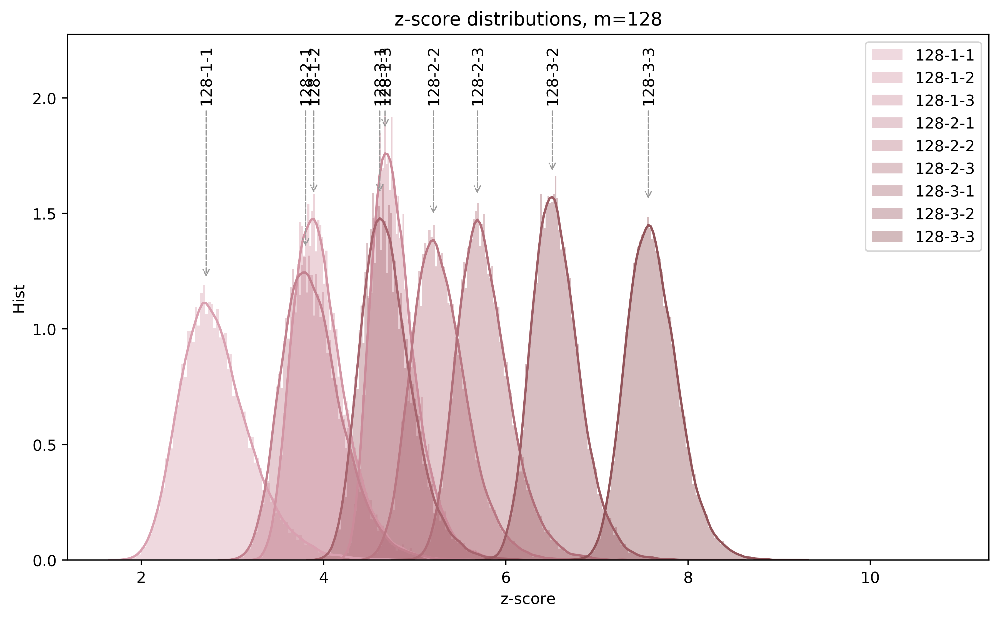
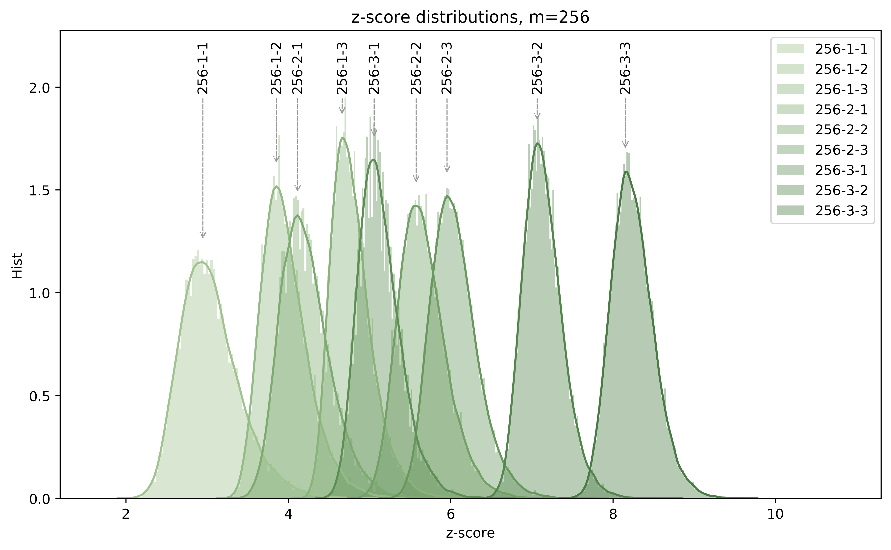
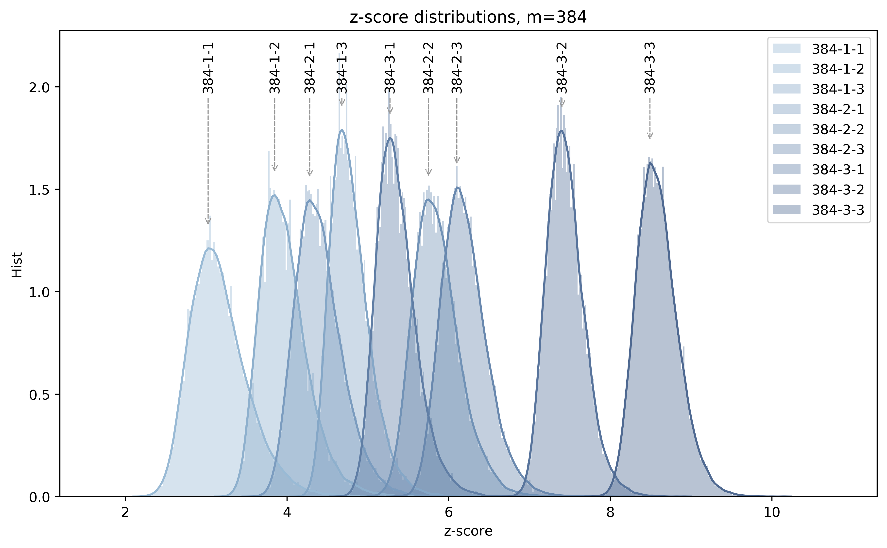
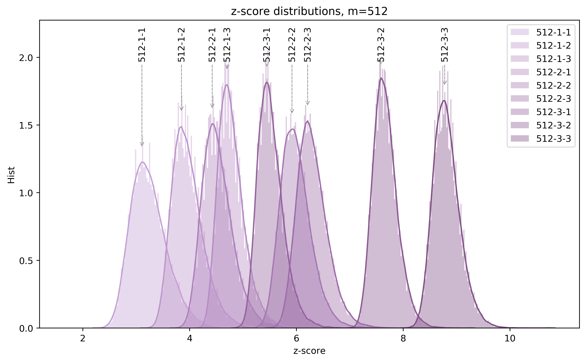

# BoolTest

[](https://travis-ci.org/ph4r05/polynomial-distinguishers)

Boolean PRNG tester - analysing statistical properties of PRNGs.

Randomness tester based on our paper published at [Secrypt 2017](https://crocs.fi.muni.cz/public/papers/secrypt2017)

## How does it work?

BoolTest generates a set of boolean functions, computes the expected result distribution when evaluated on truly random
data and compares this to the evaluation on the data being tested. 

## Pip installation

BoolTest is available via `pip`:

```
pip3 install booltest
```

## Local installation

From the local dir:

```
pip3 install --upgrade --find-links=. .
```

## The engine

BoolTest does the heavy lifting with the native python extension [bitarray_ph4](https://github.com/ph4r05/bitarray)

Bitarray operations are performed effectively using fast operations implemented in C.


# Experiments

## First launch

The following commands generate two different files, random and zero-filled.
Both are tested, the difference between files should be evident.

```
dd if=/dev/urandom of=random-file.bin bs=1024 count=$((1024*10))
dd if=/dev/zero of=zero-file.bin bs=1024 count=$((1024*10))

booltest --degree 2 --block 256 --combine-deg 2 --top 128 --tv $((1024*1024*10)) --rounds 0 random-file.bin
booltest --degree 2 --block 256 --combine-deg 2 --top 128 --tv $((1024*1024*10)) --rounds 0 zero-file.bin
```

- The BoolTest with the given parameters constructs all polynomials of degree 2 
from monomials {x_0, ..., x_{255}}
- Evaluates all polynomials on the input data (windowing), computes zscore from the 
computed vs reference data 
- Selects 128 best polynomials (abs(zscore))
- Phase 2: Take the best 128 polynomials and combine them by XOR 
to the `--combine-deg` number of terms. 
- The resulting polynomials are evaluated again and results printed out.

## Common testing parameters

We usually use BoolTest with the following testing parameters:

```
--top 128 --no-comb-and --only-top-comb --only-top-deg --no-term-map --topterm-heap --topterm-heap-k 256
```

The same can be done with the `--default-params`

## Output and p-values

BoolTest returns zscores of the best distinguishers.

In order to obtain a p-value from the Z-score you need to compute a reference experiments, i.e., compute N BoolTest experiments on a random data and observe the z-score distribution.
Z-score is data-size invariant but it depends on the BoolTest parameters `(n, deg, k)`.

The most straightforward evaluation is to check whether z-score obtained from the real experiment has been observed in the reference runs. 
If not, we can conclude the BoolTest rejects the null hypothesis with pvalue `1/N`.

To obtain lower alpha you need to perform more reference experiments, 
to obtain higher alpha integrate the z-score histogram from tails to mean to obtain desired percentage of the area under z-score histogram.

The file [pval_db.json](https://github.com/ph4r05/polynomial-distinguishers/blob/master/pval_db.json) contains reference z-score -> pvalue mapping for N=20 000 reference runs.

BoolTest now supports adding pvalue database as a parameter `--ref-db path-to-db.json`
If the database is not given, BoolTest tries to locate the default `pval_db.json` in the BoolTest installation directory and on the path.

If the database is found, BoolTest shows also OK/reject result for the best distinguisher, given the reference database contains the 
data for given `(n, deg, k)` parameters.

Example:
```
 - best poly zscore  -5.37867, expp: 0.0625, exp:   10240, obs:    9713, diff:  5.1464844 %, poly: [[64, 245, 207, 242]]
2019-12-13 20:25:17 PHX booltest.booltest_main[51363] INFO Ref samples: 40005, min-zscrore: 4.838657, max-zscore: 7.835336, best observed: 5.3786712268614005, rejected: False, alpha: 2.4996875390576178e-05
```

## Halving method

We have implemented another evaluation method called halving, enabled with commandline option `--halving`.
It needs twice more data than the default method, because of how it works:

- The input file is divided to two halves
- BoolTest runs as before on the first half, picks the best distinguisher
- BoolTest runs the best distinguisher on the second half
- As the best distinguisher selected to the second half "never seen" 
the second half and there is only one polynomial the p-value can be directly computed due to independence.

The best distinguisher results are essentially following Binomial distribution:
`Bi(number_of_blocks, probability_of_dist_eval_to_1)`.

To compute the p-value we run the Binomial test:
```scipy.stats.binom_test(observed_ones, n=ntrials, p=dist_probab, alternative='two-sided')``` 
 
This method eliminates a need to have a `pval_db.json` database computed with the reference data for given parameters.
The benefit is the halving method gives directly a p-value, without a need to run reference computations.
The downside is the method needs twice more data and can give weaker results than the original BoolTest evaluation.

Example:
```
 - zscore[idx00]: -0.40825, observed: 00010200, expected: 00010240   idx:      0, poly: [[64, 245, 207, 242]]
2019-12-13 20:25:17 PHX booltest.booltest_main[51363] INFO Binomial dist, two-sided pval: 0.6868421673496484, pst: 0.0625, ntrials: 163840, succ: 10200
```

## Java random

Analyze output of the `java.util.Random`, use only polynomials in the specified file. Analyze 100 MB of data:

```
booltest --degree 2 --block 512 --combine-deg 2 --top 128 --tv $((1024*1024*100)) --rounds 0 \
  --poly-file data/polynomials/polynomials-randjava_seed0.txt \
  randjava_seed0.bin
```

## Input data

BoolTest can test:

- Pregenerated data files
- Use the [CryptoStreams] configuration files to generate input data on the fly, using [CryptoStreams] (library contains plenty round-reduced cryptographic primitives)
 
## Cluster computation (Metacentrum)

- Map / Reduce. 
  - The `booltest/testjobs.py` creates job files
  - The `booltest/testjobsproc.py` processes result files
- BoolTest job is configured via JSON file. Result of a computation is JSON file.
- The `booltest/testjobsbase.py` performs job aggregation, i.e., more BoolTest runs in one shell script as job planning overhead is non-negligible. Useful for fast running jobs.
- Works with PBSPro, qsub queueing algorithm


### Example - generate jobs from [CryptoStreams] configurations

```bash
python ../booltest/booltest/testjobs.py  \
    --data-dir $RESDIR --job-dir $JOBDIR --result-dir=$RESDIR \
    --top 128 --matrix-size 1 10 100 --matrix-block 128 256 384 512 --matrix-deg 1 2 3 --matrix-comb-deg 1 2 3 \
    --no-comb-and --only-top-comb --only-top-deg --no-term-map --topterm-heap --topterm-heap-k 256 \
    --skip-finished --no-functions --ignore-existing \
    --generator-folder ../bool-cfggens/ --generator-path ../bool-cfggens/crypto-streams_v2.3-13-gff877be
```

For all [CryptoStreams] configuration files located under `../bool-cfggens/` it generates BoolTest tests
with parameters: 

```
input_size x block_size x deg x comb-deg
{1, 10, 100} x {128, 256, 384, 512} x {1, 2, 3} x {1, 2, 3}
```

- Command generates PBSPro shell scripts to `$JOBDIR`, results are placed into `$RESDIR`.
- For one configuration file which is typically round reduced crypto primitive it performs `3*4*3*3 = 108 tests`.
- When using CryptoStreams config files the config files have to specify the longest tested input, in this case, 100 MB.


### Example - analyze input files

```bash
python ../booltest/booltest/testjobs.py  \
    --test-files ../card_prng/*.bin \
    --data-dir $RESDIR --job-dir $JOBDIR --result-dir=$RESDIR \
    --top 128 --matrix-size 1 10 100 --matrix-block 128 256 384 512 --matrix-deg 1 2 3 --matrix-comb-deg 1 2 3 \
    --no-comb-and --only-top-comb --only-top-deg --no-term-map --topterm-heap --topterm-heap-k 256 \
    --skip-finished --no-functions --ignore-existing 
```

This example generates job to analyze input files (e.g., smartcard generated randomness)


### Example - reference statistics

```bash
python ../booltest/booltest/testjobs.py  \
    --data-dir $RESDIR --job-dir $JOBDIR --result-dir=$RESDIR \
    --generator-path --generator-path ../bool-cfggens/crypto-streams_v2.3-13-gff877be \
    --top 128 --matrix-size 10 --matrix-block 128 256 384 512 --matrix-deg 1 2 3 --matrix-comb-deg 1 2 3 \
    --no-comb-and --only-top-comb --only-top-deg --no-term-map --topterm-heap --topterm-heap-k 256 \
    --skip-finished --ref-only --test-rand-runs 1000 --skip-existing --counters-only --no-sac --no-rpcs --no-reinit
```

Computes 1000 independent AES round 10 runs, each with different seed in the counter mode. 
Tests BoolTest in various configurations.

## Reference data

Reference data extracted from the `pval_db.json` for standard parameters are displayed in the table below.
The z-score distribution does not change with data length for random data.

The table shows minimal and maximal observed z-score with given number of samples for given BoolTest parameters run on a random data.
If your test gives z-score outside of the interval the null hypothesis is rejected with the given alpha.
 

|     block |       deg |  comb-deg |   samples |     alpha |       min |       max |      mean |    stddev |
|-----------|-----------|-----------|-----------|-----------|-----------|-----------|-----------|-----------|
|       128 |         1 |         1 |    100000 |   1.0e-05 |  1.692451 |  6.167706 |  2.827212 |  0.392073 |
|       128 |         1 |         2 |    100000 |   1.0e-05 |  3.205285 |  6.203124 |  3.968438 |  0.296394 |
|       128 |         1 |         3 |    100000 |   1.0e-05 |  4.075543 |  6.790043 |  4.786912 |  0.252671 |
|       128 |         2 |         1 |    100000 |   1.0e-05 |  2.935793 |  6.447060 |  3.888612 |  0.336659 |
|       128 |         2 |         2 |    100000 |   1.0e-05 |  4.358132 |  7.336712 |  5.284895 |  0.303586 |
|       128 |         2 |         3 |    100000 |   1.0e-05 |  4.873983 |  7.796648 |  5.770370 |  0.295979 |
|       128 |         3 |         1 |    100000 |   1.0e-05 |  3.866804 |  6.823321 |  4.708614 |  0.290063 |
|       128 |         3 |         2 |    100000 |   1.0e-05 |  5.698085 |  8.376927 |  6.560998 |  0.265912 |
|       128 |         3 |         3 |    100000 |   1.0e-05 |  6.749871 |  9.570848 |  7.616965 |  0.282312 |
|       256 |         1 |         1 |    100000 |   1.0e-05 |  1.999939 |  5.302164 |  3.044472 |  0.368626 |
|       256 |         1 |         2 |    100000 |   1.0e-05 |  3.191316 |  6.303923 |  3.969717 |  0.297037 |
|       256 |         1 |         3 |    100000 |   1.0e-05 |  4.096477 |  7.026620 |  4.786630 |  0.252239 |
|       256 |         2 |         1 |    100000 |   1.0e-05 |  3.304946 |  6.601629 |  4.221227 |  0.310189 |
|       256 |         2 |         2 |    100000 |   1.0e-05 |  4.775841 |  7.609938 |  5.659143 |  0.293182 |
|       256 |         2 |         3 |    100000 |   1.0e-05 |  5.188120 |  8.305500 |  6.051743 |  0.289642 |
|       256 |         3 |         1 |    100000 |   1.0e-05 |  4.389393 |  7.001934 |  5.130026 |  0.263766 |
|       256 |         3 |         2 |    100000 |   1.0e-05 |  6.402618 |  9.003259 |  7.139777 |  0.245306 |
|       256 |         3 |         3 |    100000 |   1.0e-05 |  7.408662 |  9.833698 |  8.247723 |  0.263262 |
|       384 |         1 |         1 |    100000 |   1.0e-05 |  2.175556 |  5.326058 |  3.165671 |  0.359287 |
|       384 |         1 |         2 |    100000 |   1.0e-05 |  3.214039 |  6.110398 |  3.968937 |  0.296144 |
|       384 |         1 |         3 |    100000 |   1.0e-05 |  4.138595 |  7.017427 |  4.787164 |  0.252258 |
|       384 |         2 |         1 |    100000 |   1.0e-05 |  3.563257 |  6.406780 |  4.405090 |  0.297651 |
|       384 |         2 |         2 |    100000 |   1.0e-05 |  4.972945 |  7.606778 |  5.859061 |  0.288056 |
|       384 |         2 |         3 |    100000 |   1.0e-05 |  5.355741 |  8.065769 |  6.201906 |  0.284984 |
|       384 |         3 |         1 |    100000 |   1.0e-05 |  4.621511 |  7.317737 |  5.363479 |  0.251736 |
|       384 |         3 |         2 |    100000 |   1.0e-05 |  6.729801 |  8.957334 |  7.454564 |  0.235683 |
|       384 |         3 |         3 |    100000 |   1.0e-05 |  7.666722 | 10.225207 |  8.585460 |  0.254527 |
|       512 |         1 |         1 |    100000 |   1.0e-05 |  2.292019 |  5.580788 |  3.250047 |  0.351051 |
|       512 |         1 |         2 |    100000 |   1.0e-05 |  3.177457 |  5.980500 |  3.968829 |  0.295422 |
|       512 |         1 |         3 |    100000 |   1.0e-05 |  4.143849 |  6.820400 |  4.786089 |  0.251366 |
|       512 |         2 |         1 |    100000 |   1.0e-05 |  3.736198 |  6.505483 |  4.530410 |  0.289203 |
|       512 |         2 |         2 |    100000 |   1.0e-05 |  5.156339 |  7.839674 |  5.997271 |  0.286677 |
|       512 |         2 |         3 |    100000 |   1.0e-05 |  5.459804 |  8.324528 |  6.304574 |  0.283540 |
|       512 |         3 |         1 |    100000 |   1.0e-05 |  4.840198 |  7.196232 |  5.520881 |  0.242361 |
|       512 |         3 |         2 |    100000 |   1.0e-05 |  6.931561 |  9.324313 |  7.667548 |  0.228464 |
|       512 |         3 |         3 |    100000 |   1.0e-05 |  7.886802 | 10.312977 |  8.815687 |  0.249666 |


## Reference z-score distributions






# Installation

## Scipy installation with pip

```
pip install pyopenssl
pip install pycrypto
pip install git+https://github.com/scipy/scipy.git
pip install --upgrade --find-links=. .
```

## Virtual environment

It is usually recommended to create a new python virtual environment for the project:

```
virtualenv ~/pyenv
source ~/pyenv/bin/activate
pip install --upgrade pip
pip install --upgrade --find-links=. .
```

## Deployments

For various deployment information see [Deployments.md](DEPLOYMENTS.md). 


## Python 3.5+

BoolTest does not work with lower Python version. Use `pyenv` to install a new Python version.
It internally downloads Python sources and installs it to `~/.pyenv`.

```
git clone https://github.com/pyenv/pyenv.git ~/.pyenv
echo 'export PYENV_ROOT="$HOME/.pyenv"' >> ~/.bashrc
echo 'export PATH="$PYENV_ROOT/bin:$PATH"' >> ~/.bashrc
echo 'eval "$(pyenv init -)"' >> ~/.bashrc
exec $SHELL
pyenv install 3.7.1
pyenv local 3.7.1
```

The recommended version is Python 3.5+

# SECRYPT 2017

For SECRYPT 2017 related experiments check out [SECRYPT2017.md](SECRYPT2017.md)


[CryptoStreams]: https://github.com/crocs-muni/CryptoStreams
